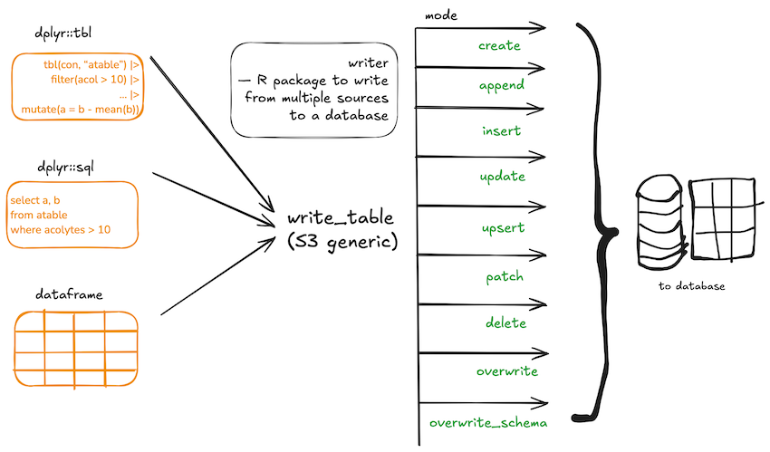

<!-- README.md is generated from README.Rmd. Please edit that file -->

# writer

<!-- badges: start -->
<!-- badges: end -->

`writer` package provides unified syntax to write data from lazy dplyr
tbl or dplyr sql query or a dataframe to a database table with modes
such as `create`, `append`, `insert`, `update`, `upsert`, `patch`,
`delete`, `overwrite`, `overwrite_schema`.



## Installation

``` r
install.packages("writer")
remotes::install("talegari/writer")
```
